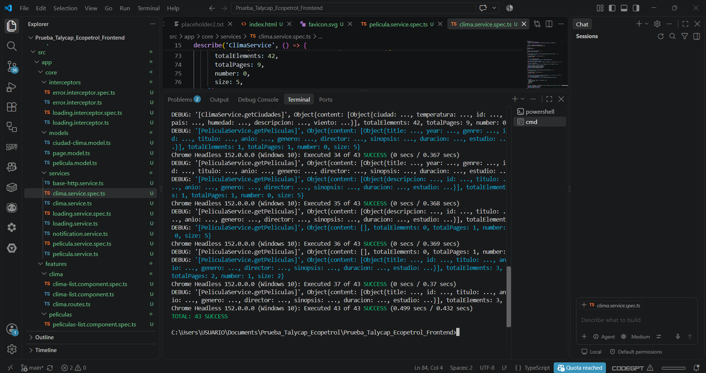
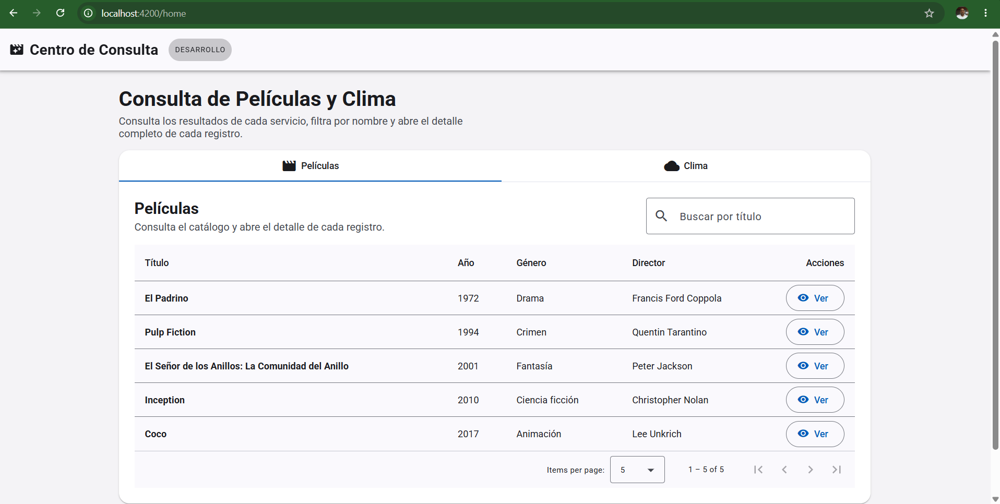
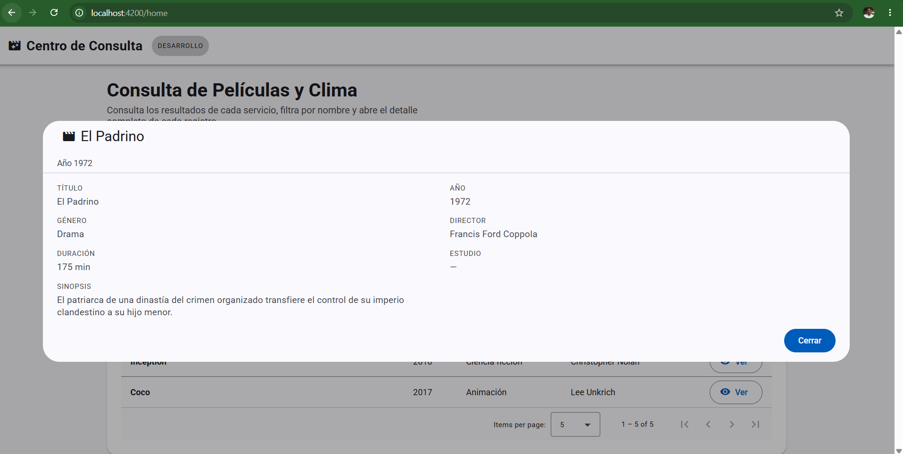
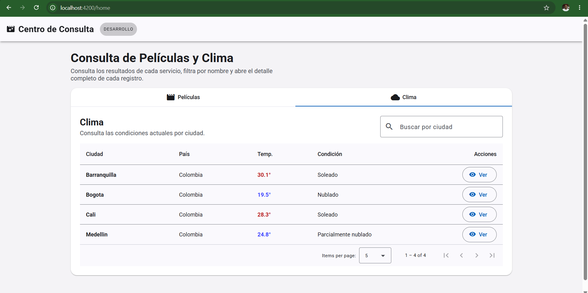
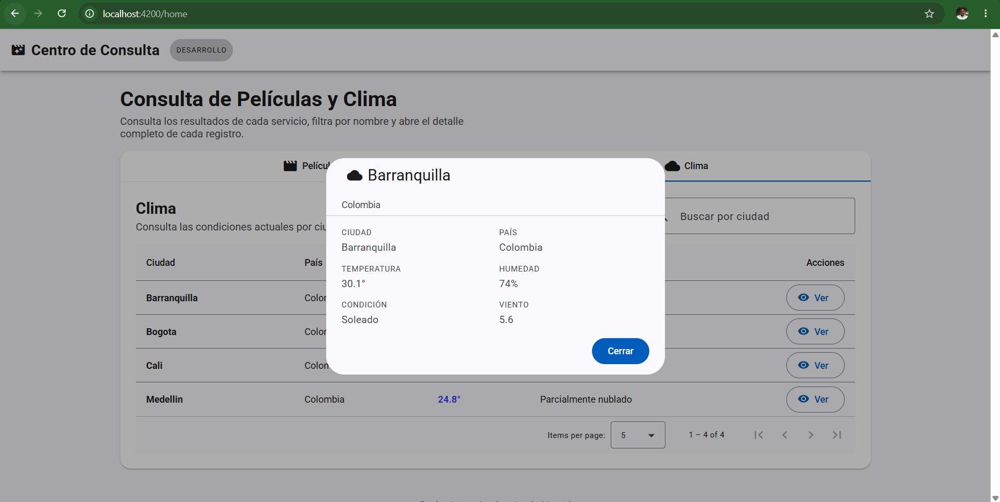
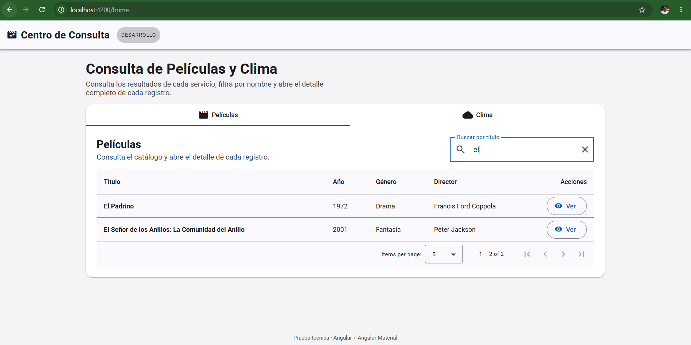
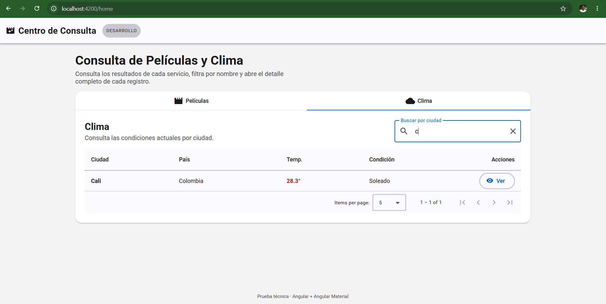

# Prueba_Talycap_Ecopetrol_Frontend
Aplicación web desarrollada con **Angular 20 (standalone + signals)**, **Angular Material** y **SCSS** para consultar **películas** y **clima** consumiendo APIs REST.

El proyecto cumple con los requisitos de la prueba técnica:

- **Core**: modelos, servicios HTTP, interceptores y estado de carga.
- **Shared**: componentes reutilizables (tabla paginada y popup de detalle).
- **Features**: `home`, `películas` y `clima` con _lazy loading_.
- **Estilos**: SCSS dinámicos y responsive + tema de Angular Material 3.
- **Tests**: pruebas unitarias básicas con Karma/Jasmine.
- **CI/CD**: pipeline de GitHub Actions con variables parametrizadas.
- **Documentación** y verificación de build.

---

## 1. Tecnologías
| Área            | Tecnología                                        |
| --------------- | ------------------------------------------------- |
| Framework       | Angular 20 (standalone components, signals)       |
| UI              | Angular Material 3 (tema azure)                   |
| Estilos         | SCSS (responsive, tokens de sistema, mobile-first)|
| HTTP            | `HttpClient` con interceptores funcionales        |
| Estado          | `signal` / `computed` para estado local y global  |
| Tests           | Karma + Jasmine (Chrome Headless) + cobertura     |
| CI/CD           | GitHub Actions                                    |
| Backend esperado| APIs REST en `apiBaseUrl` (por defecto `localhost:44357`) |

---

## 2. Estructura del proyecto
```
src/
├── app/
│   ├── core/                          # Núcleo transversal (sin UI)
│   │   ├── models/                    # Contratos tipados
│   │   │   ├── page.model.ts          # PageResponse, ApiError, Identifiable
│   │   │   ├── pelicula.model.ts      # Pelicula
│   │   │   └── ciudad-clima.model.ts  # CiudadClima
│   │   ├── services/
│   │   │   ├── base-http.service.ts   # URL, normalización de paginación, mapeo
│   │   │   ├── pelicula.service.ts    # GET /api/peliculas
│   │   │   ├── clima.service.ts       # GET /ap/clima
│   │   │   ├── loading.service.ts     # Estado global de carga (signal)
│   │   │   └── notification.service.ts# Snackbars de Material
│   │   └── interceptors/
│   │       ├── loading.interceptor.ts # start/stop del spinner global
│   │       └── error.interceptor.ts   # normaliza fallos a ApiError
│   ├── shared/                        # Componentes reutilizables
│   │   └── components/
│   │       ├── data-table/            # Tabla paginada + templates proyectados
│   │       ├── detail-dialog/         # Popup de detalle reutilizable
│   │       └── not-found/             # Página 404
│   ├── features/
│   │   ├── home.component.ts          # Toggle (MatTabs) entre features
│   │   ├── peliculas/
│   │   │   ├── peliculas.routes.ts    # Rutas lazy
│   │   │   └── peliculas-list.component.ts
│   │   └── clima/
│   │       ├── clima.routes.ts        # Rutas lazy
│   │       └── clima-list.component.ts
│   ├── app.component.ts               # Shell (toolbar + progress bar global)
│   ├── app.config.ts                  # Providers: router, http, interceptor, animations
│   └── app.routes.ts                  # Rutas raíz con lazy loading
├── environments/                      # Configuración por ambiente
├── styles.scss                        # Tema Material 3 + utilidades globales
└── index.html
scripts/set-environment.mjs            # Inyección de variables para CI/CD
.github/workflows/ci.yml               # Pipeline CI/CD
```

---

## 3. Requisitos previos
- **Node.js** 20 LTS o superior
- **npm** 10 o superior
- **Google Chrome** instalado (para los tests headless)

---

## 4. Puesta en marcha
```powershell
# 1. Instalar dependencias
npm install
# 2. Levantar en desarrollo (http://localhost:4200)
npm start
```

> Las APIs deben estar disponibles en la URL configurada (`environment.apiBaseUrl`).
> Si el backend expone otras rutas, ajústalas en `src/environments/environment.ts`.

---

## 5. Scripts disponibles
| Script                | Descripción                                              |
| --------------------- | -------------------------------------------------------- |
| `npm start`           | Servidor de desarrollo con recarga en caliente.          |
| `npm run build`       | Build de producción.                                     |
| `npm run build:dev`   | Build de desarrollo (sin optimización, con sourcemaps).  |
| `npm run build:prod`  | Build de producción explícito.                           |
| `npm run build:staging` | Build de staging.                                      |
| `npm test`            | Tests unitarios en Chrome Headless (una sola pasada).    |
| `npm run test:ci`     | Tests + reporte de cobertura (para CI).                  |
| `npm run set-env -- <target>` | Inyecta variables de ambiente (`development`/`staging`/`production`). |

---

## 6. Consumo de las APIs
Los servicios heredan de `BaseHttpService`, que centraliza la construcción de
URLs y **normaliza tres formatos de respuesta** habituales para que la UI siempre
reciba una `PageResponse<T>`:

1. Array plano: `[ { ... }, { ... } ]` → se pagina en el cliente.
2. Envoltura genérica: `{ data: [...], total: n }`.
3. Spring Data: `{ content: [...], totalElements: n, totalPages: n }`.

El **mapeo es defensivo**: cada modelo admite varios alias de campo
(`title`/`titulo`, `city`/`ciudad`, `temperature`/`temperatura`, etc.), por lo que
la aplicación tolera contratos de backend ligeramente distintos sin cambios.

### Endpoints esperados
| Recurso   | Método | Ruta             | Parámetros                       |
| --------- | ------ | ---------------- | -------------------------------- |
| Películas | GET    | `/api/peliculas` | `page`, `size`, `titulo?`        |
| Clima     | GET    | `/ap/clima`      | `page`, `size`, `ciudad?`        |

---

## 7. Arquitectura de la interfaz
- **`AppComponent`** actúa como _shell_: toolbar, badge de ambiente y barra de
  progreso global enganchada a `LoadingService.isLoading` (signal).
- **`HomeComponent`** usa `MatTabs` para alternar entre las features de películas
  y clima.
- **Rutas**: cada feature se carga con `loadChildren` → _lazy loading_ real
  (chunks independientes verificables en el build).
- **Componentes compartidos**: `DataTableComponent` y `DetailDialogComponent` no
  conocen los modelos de dominio; las features proyectan `ng-template` para las
  celdas y entregan campos ya formateados al detalle. Esto permite reutilizarlos
  con cualquier entidad sin acoplamiento.
- **Estado**: cada listado gestiona `signals` (`peliculas`, `total`, `loading`,
  `error`, filtro y paginación) con `ChangeDetectionStrategy.OnPush`.

### Estados de la UI
- **Carga**: overlay en la tabla (`mat-spinner`) + barra de progreso global.
- **Vacío**: mensaje cuando no hay resultados.
- **Error**: banner con mensaje legible y botón **Reintentar**, más snackbar.

---

## 8. Estilos
- Tema de **Angular Material 3** generado con `mat.theme(...)` en `styles.scss`
  (paleta azure, tipografía Roboto, densidad 0).
- Se usan **tokens de sistema** (`--mat-sys-*`) para que los estilos respondan al
  tema (colores, superficie, error, niveles de elevación).
- **Responsive mobile-first** con `clamp()` para tipografía fluida y utilidad
  `.hide-xs` / `.hide-md` para ocultar columnas en pantallas pequeñas.
- **Estilos dinámicos**: la temperatura del clima cambia de color según su valor
  (`temp-frio`, `temp-templado`, `temp-calido`).

---

## 9. Tests unitarios
Se cubren servicios, interceptores, componentes compartidos, features y rutas:

- `pelicula.service.spec.ts` / `clima.service.spec.ts`: mapeo y normalización de
  respuestas, parámetros de filtro y paginación en cliente.
- `loading.service.spec.ts`: contador con peticiones concurrentes.
- `loading.interceptor.spec.ts` / `error.interceptor.spec.ts`: activación de
  carga y normalización de errores HTTP a `ApiError`.
- `data-table.component.spec.ts` / `detail-dialog.component.spec.ts`: render y
  emisión de eventos de los componentes compartidos.
- `peliculas-list.component.spec.ts` / `clima-list.component.spec.ts`: carga
  inicial, filtros, formato y estados de error.
- `app.routes.spec.ts`: verificación de lazy loading y rutas comodín.

```powershell
npm test           # ejecución simple
npm run test:ci    # con cobertura (genera /coverage)
```

- 


---

## 10. CI/CD (GitHub Actions)

El pipeline **`.github/workflows/ci.yml`** se dispara en `push`/`pull_request`
sobre `main` y `develop`, además de `workflow_dispatch`.

**Job 1 · `build-and-test`** (siempre): `npm ci` → verificación de tipos
(`tsc --noEmit`) → tests con cobertura → publicación del reporte → build de
desarrollo.

**Job 2 · `build-production`** (en `main` o manual): inyecta las variables
parametrizadas y construye el bundle de producción como artefacto.

### Variables parametrizadas
Se configuran en **Settings → Secrets and variables → Actions**:

| Nombre              | Tipo     | Uso                                  | Valor por defecto   |
| ------------------- | -------- | ------------------------------------ | ------------------- |
| `API_BASE_URL`      | Variable | URL base de las APIs                 | `localhost:44357`    |
| `API_KEY`           | Secret   | Key opcional del backend             | vacío               |
| `DEFAULT_PAGE_SIZE` | Variable | Tamaño de página por defecto         | `5`                 |
| `PELICULAS_PATH`    | Variable | Ruta del endpoint de películas       | `/api/peliculas`    |
| `CLIMA_PATH`        | Variable | Ruta del endpoint de clima           | `/ap/clima`         |
| `HTTP_TIMEOUT_MS`   | Variable | Timeout por petición (ms)            | `15000`             |

El script `scripts/set-environment.mjs` reemplaza los marcadores
`__API_BASE_URL__` / `__API_KEY__` en los archivos de entorno **en tiempo de
build**, de modo que **ningún secreto se versiona**.

---

## 11. Verificación del build
```powershell
npm run build:prod
```

Resultado esperado:

- Compilación sin errores y respetando los _budgets_ configurados en `angular.json`.
- Salida en `dist/prueba-talycap-ecopetrol-frontend/browser/`.
- **Chunks separados por feature** (`chunk-*` para películas y clima), evidencia
  del _lazy loading_.

Para probar la compilación de producción en local sin marcadores, copia el
archivo local de ejemplo:

```powershell
Copy-Item src/environments/environment.prod.local.ts src/environments/environment.prod.ts
npm run build:prod
```

---

## 12. Notas y decisiones de diseño
- **Standalone + `ApplicationConfig`**: sin `NgModule`; configuración central en
  `app.config.ts`.
- **Interceptores funcionales**: encadenados en orden
  (`loadingInterceptor` → `errorInterceptor`).
- **`OnPush` + signals**: renderizado eficiente y sin fugas de suscripciones en
  plantillas (se usan `computed`).
- **Mapeo defensivo**: la app no se rompe si el backend cambia nombres de campos
  u omite el `id`.

## 13. Pruebas de Usuario Final

 - 
 - 
 - 
 - 
 - 
 - 